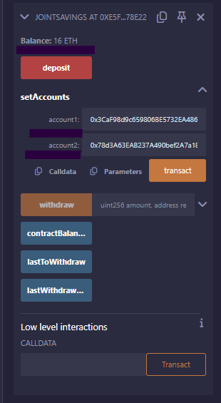
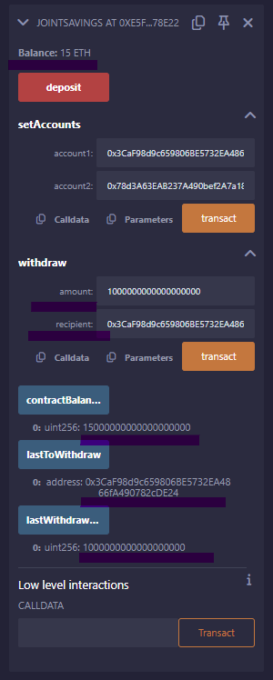
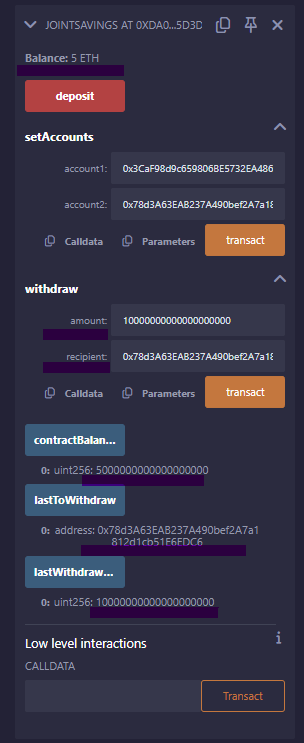
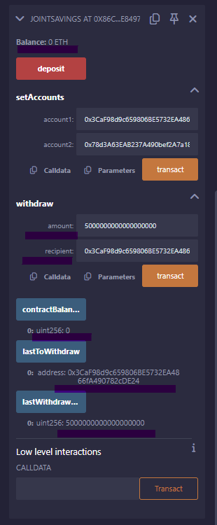

# Solidity Smart Contract Execution Results

## Contents
* [Deploying](#deploying-solidity-smart-contract)
* [Deposit Function Used](#depositing-ether)
* [Transaction I -- Send 1 Ether as Wei](#transaction-1---send-1-eth-as-wei)
* [Transaction II -- Send 10 Ether as Wei To Account 2](#transaction-2---send-10-eth-as-wei-to-account-2)
* [Transaction III -- Send 5 Ether as Wei To Account 1](#transaction-3---send-5-eth-as-wei-to-account-1)
* [Conclusion](#conclusion)

## Deploying Solidity Smart Contract
To deploy a contract simply means to create a new contract. With a successful compilation of the smart contract using the Remix IDE, the Deploy button is clicked to deploy the smart contract, and then confirmation is given when it has successfully deployed.

## Depositing Ether 
In order to fully test the functionalities of the contract, a deposit has to be made for testing purposes. Using the `setAccount` function, two addresses were assigned to withdraw funds from your contract. 
`Account1`address *0x3CaF98d9c659806BE5732EA4866fA490782cDE24*

`Account2` address *0x78d3A63EAB237A490bef2A7a1812d1cb51E6EDC6*

## Transaction 1 - Send 1 ETH as Wei
Using the `withdraw` functionality, 1000000000000000000 Wei equivalent of 1 ETH to Account1
* The following function need to be implemented as well to perform its own unique functions:
    - `contractBalance` : to verify that the funds were withdrawn from the contract
    - `lastToWithdraw` : verify address was right
    - `lastWithdrawAmount`: verify amount was correct amount withdrawn
* It can be attested that the deposit of 16 ETH has been decreased to 15 ETH showing that all functions are successfully working

## Transaction 2 - Send 10 ETH as Wei to Account 2
Using the `withdraw` functionality, 10000000000000000000 Wei equivalent of 10 ETH to Account2
* The following function need to be implemented as well to perform its own unique functions:
    - `contractBalance` : to verify that the funds were withdrawn from the contract
    - `lastToWithdraw` : verify address was right
    - `lastWithdrawAmount`: verify amount was correct amount withdrawn
* It can be attested that the balance of 15 ETH has been decreased to 5 ETH showing that all functions are successfully working

## Transaction 3 - Send 5 ETH as Wei to Account 1
Using the `withdraw` functionality, 5000000000000000000 Wei equivalent of 5 ETH to Account1
* The following function need to be implemented as well to perform its own unique functions:
    - `contractBalance` : to verify that the funds were withdrawn from the contract
    - `lastToWithdraw` : verify address was right
    - `lastWithdrawAmount`: verify amount was correct amount withdrawn
* It can be attested there is `0` balance when 5 ETH was withdrawn to Account 1 proving the successful execution of the smart contract

## Conclusion
In summary, this Solidity Smart Contract automates the creation of `joint savings account`. Implementing the use of ether management to provide the necessary features of the joint savings account. The features consisting of the ability to deposit and withdraw funds from the account.

